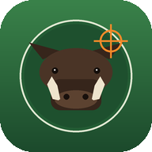

# 🐗 Boar Hunter — PWA

Un gioco **isometrico 2D cartoon** installabile su smartphone: sei un cacciatore
in una foresta, abbatti i cinghiali e caricali sulla jeep. Funziona **offline**
come Progressive Web App, gira aprendo direttamente `index.html` e si pubblica su
GitHub Pages senza backend né build.



---

## ▶️ Come avviare localmente

### Opzione A — aprire il file (rapido)
Fai doppio clic su **`index.html`**. Il gioco usa `<script>` classici e un
namespace globale (`window.BH`), quindi funziona anche da `file://` senza server.

> Nota: il **Service Worker** (offline/installazione PWA) NON si registra da
> `file://` — serve un `http(s)://`. Per provare la PWA completa usa un server locale.

### Opzione B — server locale (consigliata, abilita la PWA)
Da terminale, nella cartella del progetto:

```bash
# Python 3
python3 -m http.server 8000

# oppure Node
npx serve .
```

Poi apri <http://localhost:8000>. Su Chrome puoi verificare la PWA in
DevTools → *Application* (manifest, service worker, cache).

---

## 📱 Come pubblicare su GitHub Pages

1. Fai push del repository su GitHub.
2. Vai su **Settings → Pages**.
3. In *Build and deployment* scegli **Deploy from a branch**.
4. Seleziona branch **`main`** e cartella **`/ (root)`**, poi salva.
5. Dopo qualche minuto il gioco sarà su
   `https://<utente>.github.io/boar-hunter-pwa/`.

Tutti i percorsi sono **relativi** (`./…`), quindi manifest, service worker e
icone funzionano correttamente anche nel sottopercorso di GitHub Pages.
Da smartphone, apri l'URL e usa *"Aggiungi a schermata Home"* per installarla.

---

## 🎮 Comandi

| Azione     | Desktop                  | Mobile                    |
|------------|--------------------------|---------------------------|
| Muoversi   | `WASD` / frecce          | Joystick sinistro         |
| Sparare    | `Spazio` / `J`           | Pulsante 🎯 a destra      |
| Ricaricare | `R`                      | Pulsante ⟳                |
| Caricare cinghiale | `E` / `F`        | Pulsante "Carica sulla jeep" |

Il fucile è orientato nella direzione di mira/movimento; i proiettili sono
visibili come traccianti.

---

## 📦 Cosa contiene la v0.1

- Schermata iniziale con titolo **Boar Hunter** e pulsante **Gioca**.
- Mappa **isometrica** forestale generata proceduralmente (erba, sentiero,
  alberi, rocce, cespugli) con **ombre** e **ordinamento per profondità**.
- **Cacciatore** riconoscibile (cappello, giacca hi-vis, fucile orientato).
- Movimento fluido desktop (WASD/frecce) e **touch** (joystick + pulsanti).
- **Sparo** con proiettile visibile, **munizioni** e **ricarica**.
- **Cinghiali** con IA: i timidi **scappano**, gli aggressivi **caricano**.
- **Collisioni** base, **vita** del cacciatore e danni al contatto.
- **Game Over** con Restart quando la vita arriva a zero.
- Cinghiale abbattuto → **resta a terra** → avvicinandosi appare
  **"Carica sulla jeep"** → contatore cinghiali caricati.
- **Jeep** isometrica dettagliata (ruote, cofano, parabrezza, roll-bar);
  i cinghiali caricati compaiono nel cassone.
- Obiettivo livello: **caricare 3 cinghiali** → schermata **Livello completato**.
- **PWA completa**: `manifest.json`, `sw.js`, icone 192/512 (+maskable) generate
  localmente, cache offline dei file principali.
- **Audio** procedurale via WebAudio (nessun file esterno).

Nessuna dipendenza esterna, nessun asset a pagamento: grafica disegnata su
`<canvas>` e icone generate localmente.

### Nota su Phaser 3
La consegna consentiva Phaser 3 da CDN. È stato scelto un **motore vanilla su
canvas** perché una dipendenza da CDN non è affidabile **offline** né aprendo il
file localmente (requisito primario). L'architettura è comunque a **scene**
(`sceneBoot`, `sceneMenu`, `sceneGame`) e modulare, così un porting a Phaser
resta semplice. Vedi la roadmap.

---

## 🗂️ Struttura del progetto

```
assets/
  icons/      icone PWA (PNG generate localmente) + favicon/apple-touch
  sprites/    (riservato: gli sprite v0.1 sono disegnati via canvas)
  audio/      (riservato: l'audio v0.1 è sintetizzato via WebAudio)
src/
  main.js             bootstrap, loop, canvas HiDPI, audio, registrazione SW
  game/
    config.js         costanti, math isometrica, utilità
    world.js          terreno isometrico, alberi/rocce/cespugli, collisioni
    player.js         cacciatore (movimento, mira, sparo, munizioni, vita)
    boar.js           IA cinghiali (wander/flee/charge/dead) + sprite
    jeep.js           jeep isometrica + cassone che si riempie
    ui.js             HUD e overlay DOM (menu, game over, livello completato)
    controls.js       tastiera + joystick/pulsanti touch
    sceneBoot.js      splash iniziale
    sceneMenu.js      sfondo animato del menu
    sceneGame.js      logica di gioco + render con depth-sort
index.html
style.css
manifest.json
sw.js
README.md
CHANGELOG.md
```

---

## 🛣️ Roadmap

### v0.2
- Più livelli e difficoltà crescente (numero/velocità cinghiali).
- Timer e punteggio, con salvataggio best score in `localStorage`.
- Barra di "trascinamento" del cinghiale fino alla jeep (invece del pickup istantaneo).
- Effetti particellari (polvere, sangue cartoon, foglie) e mini-mappa.
- Migliore feedback audio e musica di sottofondo in loop.

### v0.3
- Porting opzionale a **Phaser 3** con fallback al motore vanilla.
- Sprite sheet esportati in `assets/sprites/` (sostituendo il disegno runtime).
- Meteo/giorno-notte, animali diversi, potenziamenti del fucile.
- Modalità storia con obiettivi multipli e checkpoint.

---

## 🔧 Requisiti tecnici

- HTML + CSS + **JavaScript vanilla** (nessun bundler, nessuna build).
- Nessun backend, nessuna dipendenza runtime esterna.
- Testato per non produrre errori in console e per restare reattivo su mobile.

## 📄 Licenza
Progetto originale a scopo dimostrativo/educativo. Nessun marchio di terzi
riprodotto; grafica e audio generati localmente.
